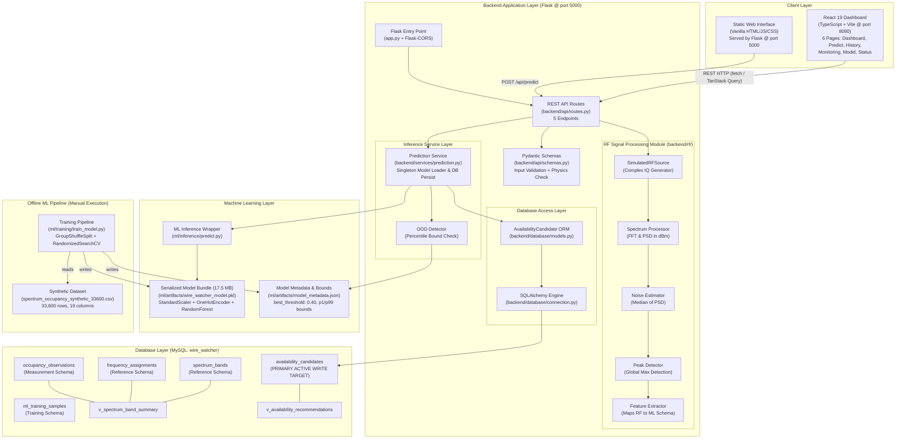
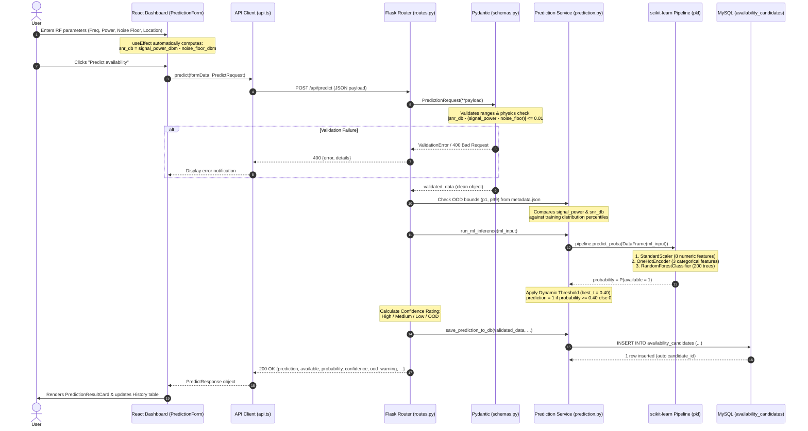
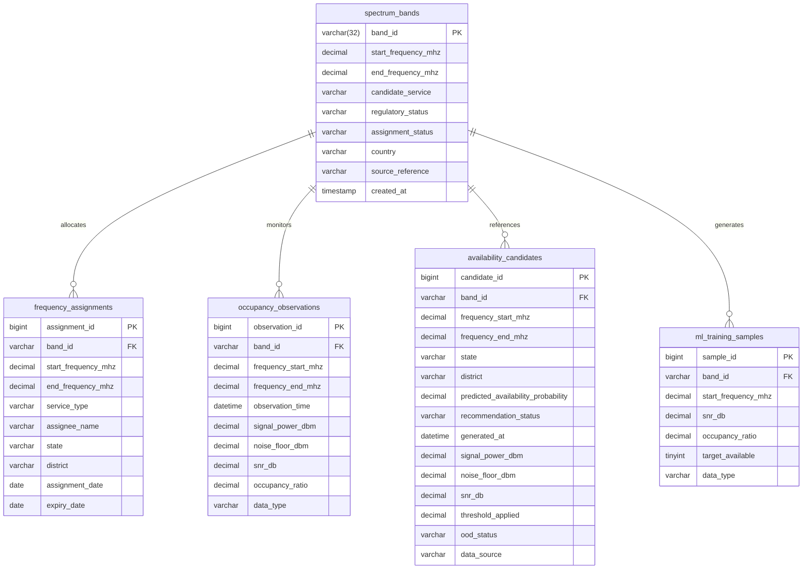
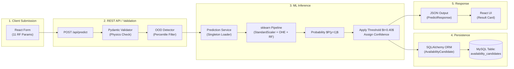
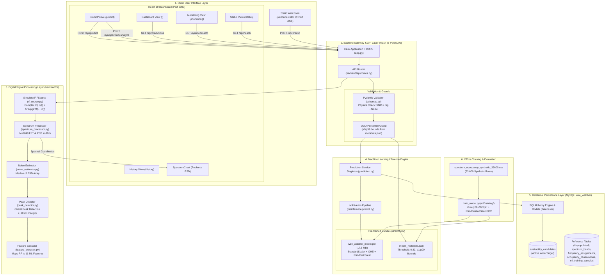

# Wire Watcher — Project Comprehensive Documentation

**Document Type:** Technical Source of Truth  
**Generated:** 2026-08-17  
**Repository:** `d:\PROJECTS\frequency\`  
**Audience:** Student, Project Guide, Viva Examiners

> **Accuracy Notice.** This document was produced by directly inspecting every source file across the repository. It distinguishes implemented functionality from planned functionality, real data from synthetic data, and verified flows from unverified ones. No feature is claimed unless the code confirms it.

---

## Table of Contents

1. [Project Overview](#1-project-overview)
2. [Problem Statement](#2-problem-statement)
3. [System Architecture](#3-system-architecture)
4. [End-to-End Data Flow](#4-end-to-end-data-flow)
5. [Repository Structure](#5-repository-structure)
6. [Technology Stack](#6-technology-stack)
7. [Frontend Architecture](#7-frontend-architecture)
8. [Backend Architecture](#8-backend-architecture)
9. [Database Architecture](#9-database-architecture)
10. [Signal and Frequency Concepts](#10-signal-and-frequency-concepts)
11. [ML System — Detailed Explanation](#11-ml-system--detailed-explanation)
12. [ML to Database to API Integration](#12-ml-to-database-to-api-integration)
13. [Training Pipeline vs Production Pipeline](#13-training-pipeline-vs-production-pipeline)
14. [Testing](#14-testing)
15. [Configuration and Environment](#15-configuration-and-environment)
16. [How to Run the Project](#16-how-to-run-the-project)
17. [Current Implementation Status](#17-current-implementation-status)
18. [What Is Actually Working End-to-End](#18-what-is-actually-working-end-to-end)
19. [Limitations](#19-limitations)
20. [Future Improvements](#20-future-improvements)
21. [Engineering Explanation (ECE Perspective)](#21-engineering-explanation-ece-perspective)
22. [Guide and Viva Explanation](#22-guide-and-viva-explanation)
23. [File-Level Implementation Map](#23-file-level-implementation-map)
24. [Important Variables and Data Structures](#24-important-variables-and-data-structures)
25. [Complete System Diagram](#25-complete-system-diagram)
26. [Final Technical Summary](#26-final-technical-summary)

---

## 1. Project Overview

### Project Name
**Wire Watcher** — Spectrum Availability Estimation Prototype

### Purpose
Wire Watcher is an Electronics and Communication Engineering (ECE) Final Year Project (FYP) that utilizes Machine Learning to estimate whether a designated radio frequency band is **available** (idle/unoccupied) or **occupied** at a specific time and geographical location. The system integrates physical RF signal simulation concepts, a pre-trained scikit-learn classifier, a Python Flask REST API, a relational MySQL database, and modern web user interfaces (a static HTML/JS fallback and a full React/TypeScript dashboard).

### Problem Being Solved
Radio frequency spectrum is a scarce, finite physical resource regulated in India by the Wireless Planning and Coordination (WPC) wing of the Department of Telecommunications (DoT) under the National Frequency Allocation Plan (NFAP-2025). While NFAP-2025 outlines static frequency allocations across services, it does not provide real-time occupancy status. Traditional spectrum monitoring relies on expensive Software Defined Radios (SDRs) or spectrum analyzers deployed across field locations with manual human oversight. Wire Watcher demonstrates an automated, data-driven approach to estimate spectrum availability from physical RF signal parameters.

### Target Users
- Telecom engineers, spectrum coordinators, and regulatory analysts
- Academic project evaluators, guides, and examiners
- Students studying cognitive radio, dynamic spectrum access, and applied ML

### Main Objective
Demonstrate a complete, integrated end-to-end software pipeline:
$$\text{User / RF Inputs} \longrightarrow \text{Flask REST API} \longrightarrow \text{Pydantic Validation} \longrightarrow \text{ML Classifier} \longrightarrow \text{MySQL Persistence} \longrightarrow \text{React Dashboard Visualization}$$

### Main Technologies
Python 3.10+ · Flask · SQLAlchemy · MySQL (InnoDB) · scikit-learn · NumPy · pandas · React 19 · TypeScript · Vite · TanStack Router · TanStack Query · Recharts · Tailwind CSS · Pydantic v2 · Zod · joblib

### Current Implementation Status
The project is a **functional software prototype**. The complete pipeline from frontend parameter submission to backend validation, Random Forest inference, MySQL persistence, and live dashboard visualization is implemented and connected. The underlying ML model was trained on **entirely synthetic data** ($N = 33,600$ rows) and is explicitly documented as a pipeline demonstration rather than a real-world predictive tool.

### Concise Explanation for a Project Guide
> "Wire Watcher is a spectrum availability estimation prototype. A user supplies RF measurement parameters (frequency range, signal power, noise floor, SNR, location, and timestamp) through a web dashboard. The Flask REST backend validates the physical consistency of the inputs (enforcing the physical law $\text{SNR} = P_{\text{signal}} - P_{\text{noise}}$), performs Out-of-Distribution (OOD) checks, and feeds the features into a pre-trained Random Forest classifier. The model outputs a probability of channel availability, applies an optimal decision threshold ($t = 0.40$), assigns a confidence rating, stores the candidate record in MySQL, and returns the prediction for live visualization on the React dashboard."

---

## 2. Problem Statement

### Real-World Problem (Simple Language)
Radio spectrum is like a multi-lane highway where each frequency band is a lane. Multiple services—such as cellular 4G/5G, FM broadcast, air traffic control, satellite communication, and emergency networks—require dedicated lanes to prevent harmful interference. Before granting temporary access or secondary usage in a band, engineers need to know if that band is currently vacant in a specific area. Manually driving spectrum monitoring vans with hardware analyzers is slow, expensive, and unscalable nationwide. Wire Watcher explores whether a machine learning model can predict channel availability from observed RF characteristics.

### Technical Problem (Engineering Language)
Spectrum occupancy sensing is fundamental to Cognitive Radio (CR) and Dynamic Spectrum Access (DSA) paradigms. A secondary user (SU) must reliably detect the presence or absence of a primary user (PU) before transmitting. While regulatory bodies publish allocation tables (e.g., India's NFAP-2025 covering up to 3000 GHz), spectrum allocation does not equal spectrum occupancy; actual utilization fluctuates heavily by time of day, geographic density, and user demand. Determining band availability requires evaluating multivariate RF indicators (received signal power, noise floor, SNR, channel bandwidth, and spatiotemporal context) against decision boundaries.

### Why Traditional Approaches Fall Short
1. **Hardware Cost & Complexity:** Continuous nationwide spectrum measurement using high-end SDRs or spectrum analyzers requires massive capital expenditure.
2. **Static Database Inadequacy:** Allocation databases (like NFAP) reflect legal entitlements, not instantaneous RF activity.
3. **Manual Analysis Latency:** Human interpretation of waterfall plots and spectrograms cannot support dynamic automated frequency re-assignment.

### How This Project Addresses It
Wire Watcher bridges regulatory knowledge with computational signal processing and ML:
- Accepts physical RF parameters and contextual metadata.
- Simulates complex baseband I/Q signals to demonstrate Fast Fourier Transform (FFT) and Power Spectral Density (PSD) computation.
- Employs a supervised ensemble classifier trained to recognize availability patterns from RF feature vectors.
- Exposes inference over HTTP with validation, dynamic thresholding, confidence evaluation, and database persistence.

> [!IMPORTANT]
> The training dataset is **100% synthetic** (`spectrum_occupancy_synthetic_33600.csv`). The model demonstrates the end-to-end data and software engineering pipeline; it does not represent empirical field measurements in Indian cities.

---

## 3. System Architecture

### Component Architecture Diagram



### Component Overview

| Component | Responsibility | Implementation Details | Key Files |
|---|---|---|---|
| **React Dashboard** | Interactive user interface, data entry, live Recharts visualization, history tables | React 19, TypeScript, TanStack Router, TanStack Query, Radix UI, Tailwind CSS | `frontend/src/` |
| **Static Web UI** | Lightweight single-page fallback client | Vanilla HTML5, CSS3, JavaScript `fetch()` | `web/index.html`, `web/main.js` |
| **Flask Backend** | API routing, CORS handling, error management, orchestration | Python 3, Flask, Flask-CORS, Blueprint architecture | `backend/app.py`, `backend/api/routes.py` |
| **Request Validator** | Strong type enforcement and physical RF law consistency checks | Pydantic v2 `BaseModel` with model validators | `backend/api/schemas.py` |
| **RF Module** | Simulated baseband IQ generation, FFT, PSD computation, noise floor estimation, peak detection | NumPy FFT routines, median filtering | `backend/rf/*.py` |
| **Prediction Service** | Singleton model management, inference execution, OOD evaluation, DB persistence | Python, joblib, SQLAlchemy ORM | `backend/services/prediction.py` |
| **ML Inference** | Preprocessing execution and probability calculation | scikit-learn Pipeline wrapper | `ml/inference/predict.py` |
| **MySQL Database** | Persistent storage of prediction candidates, regulatory tables, and view definitions | MySQL (InnoDB engine, utf8mb4) | `wirewatcher.sql` |
| **Training Pipeline** | Offline data loading, cross-validation, hyperparameter tuning, metric evaluation | scikit-learn `RandomForestClassifier`, `GroupShuffleSplit` | `ml/training/train_model.py` |

---

## 4. End-to-End Data Flow

### Sequence Diagram: Prediction Pipeline (`POST /api/predict`)



### Flow B: Spectrum Simulation & PSD Calculation (`POST /api/spectrum/analyze`)
1. User supplies `center_freq_mhz`, `bandwidth_mhz`, `signal_strength_dbm`, and `noise_floor_dbm` on the UI.
2. `SimulatedRFSource.get_signal()` generates a complex baseband signal $s(t) = s_{\text{carrier}}(t) + n(t)$ where $n(t) \sim \mathcal{CN}(0, \sigma^2)$ represents complex additive white Gaussian noise and $s_{\text{carrier}}(t) = A e^{j 2\pi f_{\text{offset}} t}$ is a sinusoidal CW carrier.
3. `compute_fft_psd()` executes an $N=2048$ point FFT, centers zero frequency via `np.fft.fftshift`, and converts magnitude to decibel-milliwatts ($\text{dBm}$).
4. `estimate_noise_floor()` extracts the median spectral density ($\text{median}(\text{PSD})$) to filter out signal peaks.
5. `detect_peaks()` identifies carriers exceeding the noise floor by a $10\text{ dB}$ margin.
6. `extract_ml_features()` converts the physical parameters into the 11-feature ML schema.
7. The JSON response returns spectral coordinates `(frequency, power_dbm)` downsampled to 200 points for real-time Recharts rendering in `SpectrumChart.tsx`.

### Flow C: Dashboard Historical Monitoring (`GET /api/predictions`)
1. The dashboard page invokes the `usePredictions()` hook powered by TanStack Query.
2. The endpoint executes `SELECT * FROM availability_candidates ORDER BY generated_at DESC LIMIT 100`.
3. The frontend normalizes column names via `normalizeRecord()`.
4. Client-side utilities (`deriveStats()`, `bucketByBand()`) compute real-time KPIs: total queries, available percentage, average probability, and band-wise distribution histograms.

---

## 5. Repository Structure

```text
frequency/                                  <- Workspace root
├── README.md                               <- High-level project summary
├── docs/
│   └── PROJECT_COMPREHENSIVE_DOCUMENTATION.md  <- Complete technical reference (this file)
│
├── database.sql                            <- Creates 'wire_watcher' database
├── spectrumbands.sql                       <- Table: spectrum_bands
├── frequencyassignments.sql                <- Table: frequency_assignments
├── observations.sql                        <- Table: occupancy_observations
├── candidates.sql                          <- Table: availability_candidates
├── "training samples.sql"                  <- Table: ml_training_samples
├── dashboard.sql                           <- View: v_spectrum_band_summary
├── indexes.sql                             <- Index definitions
├── wirewatcher.sql                         <- Master schema file (all tables & views)
│
├── backend/                                <- Python Flask REST API
│   ├── app.py                              <- Flask application entry point & CORS
│   ├── config.py                           <- Environment variables & file path resolution
│   ├── api/
│   │   ├── routes.py                       <- 5 REST endpoints
│   │   └── schemas.py                      <- Pydantic validation & physical consistency checks
│   ├── database/
│   │   ├── connection.py                   <- SQLAlchemy engine & session factory
│   │   └── models.py                       <- AvailabilityCandidate ORM model
│   ├── rf/                                 <- RF signal processing module
│   │   ├── __init__.py
│   │   ├── rf_source.py                    <- Abstract RFDataSource & SimulatedRFSource
│   │   ├── spectrum_processor.py           <- compute_fft_psd() (FFT / PSD calculation)
│   │   ├── noise_estimator.py              <- estimate_noise_floor() (median PSD)
│   │   ├── peak_detector.py                <- detect_peaks() (single-peak detector)
│   │   └── feature_extractor.py            <- extract_ml_features() (maps RF to ML schema)
│   └── services/
│       └── prediction.py                   <- Model singleton loader, inference, DB persistence
│
├── frontend/                               <- React 19 / TypeScript Web Dashboard
│   ├── package.json                        <- npm dependencies & scripts
│   ├── vite.config.ts                      <- Vite configuration (port 8080)
│   └── src/
│       ├── routes/                         <- TanStack Router pages
│       │   ├── __root.tsx                  <- Root shell with QueryClientProvider
│       │   ├── index.tsx                   <- Dashboard page (/)
│       │   ├── predict.tsx                 <- Spectrum Prediction page (/predict)
│       │   ├── history.tsx                 <- Prediction History page (/history)
│       │   ├── monitoring.tsx              <- Spectrum Monitoring page (/monitoring)
│       │   ├── model.tsx                   <- ML Model Architecture page (/model)
│       │   └── status.tsx                  <- System Status & Health page (/status)
│       ├── components/
│       │   ├── layout/AppShell.tsx         <- Sidebar navigation layout
│       │   ├── ui/                         <- Radix UI primitives (Button, Input, etc.)
│       │   └── wire/                       <- Domain components (PredictionForm, SpectrumChart, etc.)
│       ├── hooks/
│       │   └── use-wire-watcher.ts         <- TanStack Query hooks & derived statistics
│       ├── services/
│       │   └── api.ts                      <- Fetch API client with timeout & error typing
│       ├── types/
│       │   └── wire-watcher.ts             <- TypeScript interface contracts
│       └── styles.css                      <- Tailwind CSS v4 & custom design tokens
│
├── ml/                                     <- Machine Learning Training & Diagnostics
│   ├── README_ML.md                        <- ML documentation & target leakage analysis
│   ├── requirements.txt                    <- ML Python dependencies
│   ├── model_results.txt                   <- Full evaluation reports & leakage confirmation
│   ├── artifacts/
│   │   ├── wire_watcher_model.pkl          <- Production model bundle (17.5 MB, RandomForest)
│   │   └── model_metadata.json             <- Metadata, metrics, hyperparameters, OOD bounds
│   ├── data/
│   │   ├── spectrum_occupancy_synthetic_33600.csv  <- Primary training dataset (33,600 rows, SYNTHETIC)
│   │   └── ml_training_samples.csv         <- Legacy 10,000-row dataset (deprecated)
│   ├── training/
│   │   └── train_model.py                  <- Master training pipeline with RandomizedSearchCV
│   ├── evaluation/
│   │   ├── evaluate_model.py               <- Standalone model evaluation script
│   │   └── diagnostics.py                  <- Calibration & sensitivity diagnostics
│   ├── inference/
│   │   └── predict.py                      <- Runtime inference wrapper (called by backend)
│   ├── simulation/
│   │   ├── rf_signal_processor.py          <- Standalone CLI demonstration for FFT/PSD
│   │   ├── scenario_engine.py              <- 9 simulation scenarios & parameter sweeps
│   │   └── spectrum_plot.png               <- Generated PSD visualization plot
│   └── results/
│       ├── metrics.json                    <- Metric summaries across experiments
│       └── confusion_matrix_*.png          <- Confusion matrix visual artifacts
│
├── tests/
│   └── backend/
│       └── test_wirewatcher.py             <- Pytest test suite (7 API & validation tests)
│
├── web/                                    <- Fallback Static Frontend (served by Flask)
│   ├── index.html                          <- Single-page form
│   ├── main.js                             <- Vanilla JS API caller
│   └── style.css                           <- Basic stylesheet
│
└── wirewatcher/                            <- Dataset Archive & Reference Documentation
    └── Wire_Watcher_Large_Spectrum_Dataset/
        ├── README.txt                      <- Dataset description
        ├── sources.txt                     <- NFAP-2025 regulatory references
        ├── spectrum_occupancy_synthetic_33600.csv
        ├── spectrum_bands_reference_25.csv <- 25 reference regulatory bands
        └── synthetic_assignment_candidates_5000.csv
```

---

## 6. Technology Stack

| Layer | Technology | Version | Where Used | Rationale |
|---|---|---|---|---|
| **Frontend Framework** | React | 19.x | `frontend/` | Component-based reactive UI |
| **Language (Frontend)** | TypeScript | 5.x | `frontend/src/` | Type-safe API contracts and props |
| **Build Tool** | Vite | 8.x | `frontend/` | Instant HMR and optimized ES module bundling |
| **Routing** | TanStack Router | 1.170 | `frontend/src/routes/` | Type-safe, file-based routing |
| **Server State** | TanStack Query | 5.x | `frontend/src/hooks/` | Async data fetching, polling, and caching |
| **Charts** | Recharts | 2.x | `routes/`, `SpectrumChart.tsx` | SVG-based responsive charting |
| **Form Management** | React Hook Form + Zod | Latest | `PredictionForm.tsx` | Declarative form handling with schema validation |
| **CSS Framework** | Tailwind CSS | 4.x | `frontend/src/styles.css` | Utility-first, responsive styling |
| **Fallback UI** | HTML5 / Vanilla JS | — | `web/` | Minimal static client directly served by Flask |
| **Backend Framework** | Flask | 3.x / 2.x | `backend/` | Lightweight WSGI microframework for REST APIs |
| **CORS Middleware** | Flask-CORS | Latest | `backend/app.py` | Cross-origin request handling from Vite dev server |
| **Data Validation** | Pydantic | v2.x | `backend/api/schemas.py` | Strict request validation with cross-field physics rules |
| **ORM & Database** | SQLAlchemy | 2.x | `backend/database/` | Object-Relational Mapping and connection pooling |
| **MySQL Driver** | PyMySQL | Latest | `backend/config.py` | Pure Python DBAPI connector for MySQL |
| **Database Server** | MySQL | 5.7+ / 8.x | Database `wire_watcher` | Relational persistence with ACID guarantees |
| **ML Framework** | scikit-learn | 1.3+ | `ml/`, `backend/services/` | Random Forest classifier, transformers, and metrics |
| **Model Packaging** | joblib | 1.3+ | `ml/artifacts/` | Efficient serialization of NumPy-heavy pipelines |
| **Array Math** | NumPy | 1.24+ | `backend/rf/`, `ml/` | Vectorized FFT, PSD, and IQ signal generation |
| **Data Handling** | pandas | 2.0+ | `ml/` | Tabular data manipulation and DataFrame formatting |
| **Testing** | Pytest | Latest | `tests/backend/` | Automated unit and integration test suite |

---

## 7. Frontend Architecture

### Route Structure (TanStack File-Based Router)

| Route Path | Source File | Purpose | API Endpoints Called |
|---|---|---|---|
| `/` | `src/routes/index.tsx` | **Dashboard:** KPI summary cards, band-wise histogram, recent predictions table | `GET /api/predictions` |
| `/predict` | `src/routes/predict.tsx` | **Prediction:** Interactive RF parameter form, preset loader, Recharts PSD chart, result card | `POST /api/predict`, `POST /api/spectrum/analyze` |
| `/history` | `src/routes/history.tsx` | **History:** Full-screen historical query log with search, state filtering, and sorting | `GET /api/predictions` |
| `/monitoring` | `src/routes/monitoring.tsx` | **Monitoring:** Time-series availability trend chart and dynamic KPI telemetry | `GET /api/predictions`, `GET /api/model-info` |
| `/model` | `src/routes/model.tsx` | **ML Model:** Pipeline architecture breakdown, feature weights, and hyperparameters | `GET /api/health` |
| `/status` | `src/routes/status.tsx` | **System Status:** Health checks for Flask API, MySQL database, and ML model bundle | `GET /api/health`, `GET /api/model-info` |

### Key UI Components

| Component Name | File Location | Functional Description |
|---|---|---|
| `AppShell` | `components/layout/AppShell.tsx` | Responsive sidebar shell with navigation links, branding, and backend API status indicator |
| `PredictionForm` | `components/wire/PredictionForm.tsx` | 11-field input form with Zod validation, automated SNR calculation, and 5 scenario presets |
| `PredictionResultCard` | `components/wire/PredictionResultCard.tsx` | Card displaying predicted state (Available/Occupied), probability gauge, confidence tier, and OOD alert |
| `SpectrumChart` | `components/wire/SpectrumChart.tsx` | Recharts visualizer rendering Power Spectral Density (dBm vs MHz) with noise floor reference line |
| `PredictionsTable` | `components/wire/PredictionsTable.tsx` | Reusable sortable table rendering historical candidate records with status badges |
| `AvailabilityBadge` | `components/wire/AvailabilityBadge.tsx` | Styled visual badge indicating availability outcome with color coding |
| `ApiStateNotice` | `components/wire/ApiStateNotice.tsx` | Non-intrusive alert box displaying formatted API errors and connection warnings |

### State Management & Data Fetching
- **Server Cache:** Managed via TanStack Query (`@tanstack/react-query`):
  - `usePredictions()`: Fetches candidate records with a 15-second stale threshold.
  - `useHealth()`: Polls system health every 30 seconds for real-time status reporting.
  - `useModelInfo()`: Caches model metadata with a 60-second stale time.
  - `usePredict()` & `useAnalyzeSpectrum()`: React mutations for on-demand POST operations.
- **Client Form State:** Managed by `react-hook-form` coupled with `@hookform/resolvers/zod`.
- **Auto-Calculated Fields:** `PredictionForm.tsx` leverages a React `useEffect` hook to continuously compute:
  $$\text{snr\_db} = \text{signal\_power\_dbm} - \text{noise\_floor\_dbm}$$

### Built-In Scenario Presets
To facilitate live examiner demonstrations, the UI provides 5 one-click RF presets:
1. **Noise Dominated:** Signal power $-98\text{ dBm}$, Noise floor $-100\text{ dBm}$, $\text{SNR} = 2\text{ dB}$ (High likelihood of availability).
2. **Weak Signal:** Signal power $-92\text{ dBm}$, Noise floor $-105\text{ dBm}$, $\text{SNR} = 13\text{ dB}$.
3. **Intermediate Signal:** Signal power $-80\text{ dBm}$, Noise floor $-100\text{ dBm}$, $\text{SNR} = 20\text{ dB}$.
4. **Strong Signal:** Signal power $-65\text{ dBm}$, Noise floor $-95\text{ dBm}$, $\text{SNR} = 30\text{ dB}$ (Channel occupied).
5. **Below Noise Floor:** Signal power $-105\text{ dBm}$, Noise floor $-100\text{ dBm}$, $\text{SNR} = -5\text{ dB}$ (OOD trigger test).

---

## 8. Backend Architecture

### Entry Point & Middleware (`backend/app.py`)
- Initializes Flask with `static_folder` referencing `web/` to host the fallback HTML client.
- Wraps the app in `CORS(app)` allowing unrestricted cross-origin requests from the React development server (`localhost:8080`).
- Registers the API blueprint (`api_bp`) under the `/api` prefix.
- Configures global JSON response handlers.
- Server binds to `0.0.0.0:5000`.

### REST API Endpoints Specification

| Endpoint | Method | Purpose | Input Payload | Output Payload | Database Effect | ML Effect |
|---|---|---|---|---|---|---|
| `/api/health` | `GET` | System liveness & readiness check | None | `{status, model_loaded, database_connected, api, model, database}` | Executes `SELECT 1` connectivity test | Verifies `model_bundle is not None` |
| `/api/model-info` | `GET` | Metadata, hyperparameters & live KPIs | None | `{algorithm, model_version, metrics, hyperparameters, feature_importances, training_bounds, live_kpis}` | Aggregates `COUNT`, `AVG(prob)`, `SUM(available)` from DB | Reads `model_metadata.json` |
| `/api/predictions` | `GET` | Retrieves recent prediction query history | Query params (optional) | Array of up to 100 candidate objects | Executes `SELECT * FROM availability_candidates LIMIT 100` | None |
| `/api/predict` | `POST` | Executes ML availability classification | `PredictionRequest` JSON (11 required + 3 optional fields) | `{prediction, available, probability, confidence, threshold, data_source, features_used, ood_warning}` | `INSERT INTO availability_candidates` | Executes `pipeline.predict_proba()` |
| `/api/spectrum/analyze` | `POST` | Simulates complex baseband IQ & FFT | `{center_freq_mhz, bandwidth_mhz, signal_strength_dbm, noise_floor_dbm}` | `{spectrum_data: {frequencies, power_dbm}, noise_floor_dbm, detected_signals, extracted_features}` | None | Generates feature vector for ML |

### Request Validation & Physical Law Enforcement (`backend/api/schemas.py`)
Incoming requests to `POST /api/predict` are validated by Pydantic v2. Beyond type and range checks, the validator enforces physical consistency:

```python
@model_validator(mode="after")
def validate_rf_physics(self):
    expected_snr = self.signal_power_dbm - self.noise_floor_dbm
    if abs(self.snr_db - expected_snr) > 0.01:
        raise ValueError(
            f"SNR is inconsistent with RF physics. "
            f"Expected SNR = signal ({self.signal_power_dbm}) - noise ({self.noise_floor_dbm}) "
            f"= {expected_snr:.2f} dB, but received {self.snr_db:.2f} dB."
        )
    return self
```

### Out-of-Distribution (OOD) Detection
Before running inference, the backend checks whether input features reside within the empirical 1st ($p_1$) and 99th ($p_{99}$) percentiles of the training distribution stored in `model_metadata.json`:
- **Signal Power Range:** $[-91.98\text{ dBm}, -68.43\text{ dBm}]$
- **SNR Range:** $[11.43\text{ dB}, 31.89\text{ dB}]$
- If an input violates these bounds, the system sets `ood_warning = True` and forces `confidence = "OOD / Unreliable"`.

### Decision Confidence Scoring
Confidence is determined by the distance of the model's predicted probability $P$ from the decision threshold $t = 0.40$:
$$\Delta = |P - 0.40|$$
$$\text{Confidence} = \begin{cases} \text{"OOD / Unreliable"} & \text{if OOD detected} \\ \text{"High"} & \text{if } \Delta > 0.15 \\ \text{"Medium"} & \text{if } 0.05 < \Delta \le 0.15 \\ \text{"Low"} & \text{if } \Delta \le 0.05 \end{cases}$$

---

## 9. Database Architecture

### Master Database: `wire_watcher` (MySQL / InnoDB)

The schema is defined in `wirewatcher.sql`. It contains 5 tables and 2 views designed to support spectrum regulatory reference, observation logging, and candidate tracking.

### Entity-Relationship Diagram



### Table Definitions & Usage Status

#### 1. `availability_candidates` (Active Application Write Target)
Every call to `POST /api/predict` inserts an assessment record into this table via SQLAlchemy ORM (`backend/database/models.py`).

| Column Name | Data Type | Constraints | Description |
|---|---|---|---|
| `candidate_id` | `BIGINT` | `PRIMARY KEY AUTO_INCREMENT` | Unique prediction identifier |
| `band_id` | `VARCHAR(32)` | `NULL`, `FK -> spectrum_bands` | Optional reference to regulatory band |
| `frequency_start_mhz` | `DECIMAL(12,3)` | `NOT NULL` | Lower frequency boundary |
| `frequency_end_mhz` | `DECIMAL(12,3)` | `NOT NULL` | Upper frequency boundary |
| `state` | `VARCHAR(100)` | `NOT NULL` | Indian state / territory |
| `district` | `VARCHAR(100)` | `NOT NULL` | City / district name |
| `required_bandwidth_mhz` | `DECIMAL(12,3)` | `NOT NULL` | Requested channel width |
| `required_service` | `VARCHAR(100)` | `NOT NULL` | Service type (e.g., 4G LTE, 5G NR) |
| `predicted_availability_probability` | `DECIMAL(6,5)` | `NOT NULL` | Random Forest probability $[0.0, 1.0]$ |
| `recommendation_status` | `VARCHAR(40)` | `NOT NULL` | `'recommended'` if available else `'review_required'` |
| `generated_at` | `DATETIME` | `NOT NULL` | UTC timestamp of prediction |
| `model_version` | `VARCHAR(100)` | `NOT NULL` | Identifier of active ML model |
| `signal_power_dbm` | `DECIMAL(10,3)` | `NOT NULL` | Observed signal power |
| `noise_floor_dbm` | `DECIMAL(10,3)` | `NOT NULL` | Observed noise floor |
| `snr_db` | `DECIMAL(10,3)` | `NOT NULL` | Signal-to-noise ratio |
| `threshold_applied` | `DECIMAL(6,5)` | `NOT NULL` | Decision threshold utilized ($0.40$) |
| `ood_status` | `VARCHAR(10)` | `NOT NULL` | `'1'` if OOD triggered else `'0'` |
| `data_source` | `VARCHAR(50)` | `DEFAULT 'Synthetic'` | Provenance of prediction data |

#### 2. Auxiliary Tables (Defined in Schema, Unpopulated in Default Setup)
- `spectrum_bands`: Intended for official NFAP-2025 allocations ($25$ reference bands exist in CSV).
- `frequency_assignments`: Intended for licensed operator frequency assignments.
- `occupancy_observations`: Designed to store raw time-series SDR monitoring sweeps.
- `ml_training_samples`: Designed for database-driven ML dataset staging.

#### 3. Database Views
- `v_spectrum_band_summary`: Joins `spectrum_bands` with counts of assignments and observations.
- `v_availability_recommendations`: Filters candidates meeting recommendation criteria.

---

## 10. Signal and Frequency Concepts

### Engineering Principles: Theory vs. Repository Implementation

| Signal Processing Concept | Theoretical Definition | Implemented in this Codebase? | Implementation Details & File Reference |
|---|---|:---:|---|
| **Carrier Frequency ($f_c$)** | The center oscillation frequency of an electromagnetic wave in MHz. | **Yes** | Used as `center_freq_mhz` in `backend/rf/rf_source.py` and `start/end_frequency_mhz` ML features. |
| **Bandwidth ($B$)** | The total spectral span ($f_{\text{stop}} - f_{\text{start}}$) occupied by a channel. | **Yes** | Validated in `backend/api/schemas.py`; used to define sampling rate ($20\text{ MHz}$) in `rf_source.py`. |
| **Signal Power ($P_{\text{sig}}$)** | Received RF signal power expressed in decibel-milliwatts ($\text{dBm}$). | **Yes** | Linear amplitude converted via $A = \sqrt{2 \cdot 10^{(P_{\text{dBm}}/10)} \cdot 10^{-3}}$ in `backend/rf/rf_source.py`. Key ML feature. |
| **Noise Floor ($P_{\text{noise}}$)** | Thermal background noise power ($P = kTB$). | **Yes** | Estimated as the statistical **median of the PSD** array in `backend/rf/noise_estimator.py`. Robust against peak bias. |
| **Signal-to-Noise Ratio (SNR)** | Power ratio of signal to background noise: $\text{SNR}_{\text{dB}} = P_{\text{sig}} - P_{\text{noise}}$. | **Yes** | Strictly verified by Pydantic validator (`abs(\text{SNR} - (P - N)) \le 0.01$). #1 feature in ML model. |
| **Complex Baseband (I/Q)** | Quadrature representation of signals: $s(t) = I(t) + jQ(t)$. | **Yes** | `SimulatedRFSource.get_signal()` creates complex NumPy arrays: Gaussian noise + complex sinusoidal exponential. |
| **Fast Fourier Transform (FFT)** | Discrete algorithm transforming time-domain samples into frequency spectrum. | **Yes** | `compute_fft_psd()` in `backend/rf/spectrum_processor.py` runs `np.fft.fftshift(np.fft.fft(rx_signal))`. |
| **Power Spectral Density (PSD)** | Distribution of signal power across discrete frequency bins in $\text{dBm}$. | **Yes** | Computed as $10 \log_{10}(|X[k]|^2 / N^2)$ and rendered interactively via Recharts in `SpectrumChart.tsx`. |
| **Peak Detection** | Identifying active carrier frequencies exceeding the noise floor. | **Partial** | `backend/rf/peak_detector.py` finds the single global maximum exceeding $P_{\text{noise}} + 10\text{ dB}$. Multi-carrier peak search is omitted. |
| **Occupancy Ratio** | The temporal duty cycle fraction ($[0.0, 1.0]$) of channel utilization. | **Excluded from Model** | Present in synthetic CSV; deliberately excluded from training to prevent target leakage. |
| **Spectrogram / Waterfall** | Time-frequency 2D intensity representation. | **No** | Not implemented in frontend or backend. |
| **Digital Filtering** | Finite/Infinite Impulse Response (FIR/IIR) bandpass filtering. | **No** | No digital filtering is applied to simulated IQ streams. |
| **Windowing (Hann/Hamming)** | Tapering time samples to mitigate spectral leakage before FFT. | **No** | Rectangular windowing is implicitly used. |
| **CFAR Detection** | Constant False Alarm Rate adaptive thresholding. | **No** | Fixed margin ($+10\text{ dB}$) is used. |
| **Hardware SDR Ingestion** | Reading samples from physical RTL-SDR / HackRF devices. | **No** | Interface is purely simulated via `SimulatedRFSource`. |

---

## 11. ML System — Detailed Explanation

### 11.1 Objective
The ML subsystem performs **binary classification**:
$$\hat{y} \in \{0, 1\} \quad (0 = \text{Occupied}, 1 = \text{Available})$$
Given an 11-dimensional feature vector $\mathbf{x}$, the model computes the posterior probability $P(y = 1 \mid \mathbf{x})$ and compares it against an optimized threshold $t = 0.40$.

### 11.2 Dataset Properties (`spectrum_occupancy_synthetic_33600.csv`)
- **Total Records:** $33,600$
- **Total Columns:** $19$
- **Class Distribution:**
  - Class 0 (Occupied): $32,326$ samples ($96.21\%$)
  - Class 1 (Available): $1,274$ samples ($3.79\%$)
  - **Class Imbalance Ratio:** $\approx 25.4 : 1$
- **Missing / Null Values:** $0$
- **Data Authenticity:** **100% Synthetic** (`data_type = 'SYNTHETIC_FOR_PIPELINE_TESTING'`).

### 11.3 Feature Dictionary & Importance Rankings

| Feature Name | Type | Physical Unit | Source | Used in Model? | Impurity Importance (Gini) | Permutation Importance |
|---|---|---|---|:---:|:---:|:---:|
| `snr_db` | Numeric | $\text{dB}$ | RF Measurement | **Yes** | **0.363** (Rank 1) | **0.294** (Rank 1) |
| `signal_power_dbm` | Numeric | $\text{dBm}$ | RF Measurement | **Yes** | **0.223** (Rank 2) | **0.253** (Rank 2) |
| `noise_floor_dbm` | Numeric | $\text{dBm}$ | RF Measurement | **Yes** | 0.073 (Rank 3) | 0.012 |
| `hour_of_day` | Numeric | Integer ($0\text{--}23$) | Context / Clock | **Yes** | 0.072 (Rank 4) | $\approx 0.000$ |
| `day_of_week` | Numeric | Integer ($0\text{--}6$) | Context / Calendar | **Yes** | 0.053 (Rank 5) | 0.003 |
| `start_frequency_mhz` | Numeric | $\text{MHz}$ | Channel Spec | **Yes** | 0.039 (Rank 6) | 0.006 |
| `end_frequency_mhz` | Numeric | $\text{MHz}$ | Channel Spec | **Yes** | 0.038 (Rank 7) | 0.008 |
| `bandwidth_mhz` | Numeric | $\text{MHz}$ | Channel Spec | **Yes** | 0.026 (Rank 8) | 0.001 |
| `state` | Categorical | String ($28$ States) | Geography | **Yes** (OHE) | $< 0.015$ each | $\approx 0.000$ |
| `city` | Categorical | String ($50$ Cities) | Geography | **Yes** (OHE) | $< 0.010$ each | $\approx 0.000$ |
| `service_type` | Categorical | String ($6$ Services) | Regulatory Spec | **Yes** (OHE) | $< 0.020$ each | $\approx 0.000$ |
| `occupancy_ratio` | Numeric | Fraction ($[0, 1]$) | Synthetic Gen | **NO (Excluded)** | — | — |
| `interference_score` | Numeric | Score | Synthetic Gen | **NO (Excluded)** | — | — |

> [!WARNING]
> **Target Leakage Discovery:** Analysis documented in `ml/README_ML.md` revealed that the synthetic label `target_available` was generated via the deterministic rule:
> $$\text{target\_available} = 1 \iff \text{occupancy\_ratio} < 0.25$$
> Including `occupancy_ratio` (Experiment B) yielded an artificial $F_1 = 0.994$. To ensure scientific validity, `occupancy_ratio` and `interference_score` were **strictly excluded** from the production model (Experiment A).

### 11.4 Preprocessing Pipeline (`ColumnTransformer`)
1. **Numeric Features (8):** Transformed via `StandardScaler()` to zero mean and unit variance.
2. **Categorical Features (3):** Transformed via `OneHotEncoder(handle_unknown="ignore")`. Unseen categories at inference receive zero vectors, preserving stability.
3. The transformers and classifier are serialized together inside a single scikit-learn `Pipeline` object.

### 11.5 Training Methodology
- **Data Splitting:** `GroupShuffleSplit(groups=city, random_state=42)` creates a 60% Train / 20% Validation / 20% Test split. Grouping by city ensures no city appears in both training and evaluation splits, evaluating geographic generalizability.
- **Hyperparameter Optimization:** `RandomizedSearchCV` (3-fold cross-validation, scoring on $F_1$ score) over:
  - `n_estimators`: $[100, 200]$
  - `max_depth`: $[10, 20, 30]$
  - `min_samples_split`: $[2, 5]$
  - `min_samples_leaf`: $[1, 2]$
  - `class_weight`: `'balanced'` (assigns inverse frequency weights to overcome the $25:1$ imbalance).

### 11.6 Selected Model: Random Forest Classifier
- **Algorithm:** `sklearn.ensemble.RandomForestClassifier`
- **Optimal Hyperparameters:**
  - `n_estimators`: $200$ decision trees
  - `max_depth`: $20$
  - `min_samples_split`: $5$
  - `min_samples_leaf`: $1$
  - `class_weight`: `'balanced'`
- **Tree Aggregation Mechanism:** Each decision tree $T_b$ outputs an empirical class distribution for leaf node $L(\mathbf{x})$. The ensemble averages probability estimates across all $B = 200$ trees:
  $$P(y = 1 \mid \mathbf{x}) = \frac{1}{B} \sum_{b=1}^{B} P_b(y = 1 \mid \mathbf{x})$$

### 11.7 Evaluation Metrics (Test Set, $N \approx 8,400$)

| Evaluation Metric | Value | Technical Meaning & Analysis |
|---|---|---|
| **Accuracy** | $92.76\%$ | High, but uninformative due to the $96.2\%$ negative majority class baseline. |
| **Balanced Accuracy** | $73.16\%$ | Arithmetic mean of sensitivity ($51.5\%$) and specificity ($94.8\%$). |
| **Precision (Class 1)** | $33.23\%$ | Of all bands predicted "Available", $33.2\%$ were genuinely available. |
| **Recall / Sensitivity (Class 1)** | $51.50\%$ | Model successfully identifies $51.5\%$ of all genuinely available spectrum bands. |
| **$F_1$ Score (Class 1)** | $\mathbf{0.4039}$ | Harmonic mean of precision and recall; primary metric for model selection. |
| **ROC-AUC** | $\mathbf{0.9061}$ | Area under the Receiver Operating Characteristic curve; demonstrates strong ranking capability. |
| **PR-AUC** | $0.3381$ | Area under the Precision-Recall curve for the minority positive class. |
| **Brier Score** | $0.0431$ | Mean squared probability error (lower represents superior calibration). |
| **False Positives (FP)** | $414$ | Occupied bands incorrectly classified as Available. |
| **False Negatives (FN)** | $194$ | Available bands missed by the classifier. |

### 11.8 Dynamic Threshold Optimization
Rather than assuming a default $t = 0.50$ (which would miss minority positive samples due to prior probability skew), the training pipeline performs a grid search over validation probabilities:
$$t^* = \arg\max_{t \in [0.10, 0.90]} F_1(y_{\text{val}}, \hat{y}(t))$$
- **Optimal Threshold Found:** $\mathbf{t^* = 0.40}$
- Stored in `model_metadata.json` and loaded dynamically by the inference backend.

### 11.9 Serialization & Storage
- **Artifact File:** `ml/artifacts/wire_watcher_model.pkl` ($17,876,461$ bytes $\approx 17.5\text{ MB}$).
- **Serialized Structure:**
  ```python
  {
      "pipeline": Pipeline(steps=[
          ("preprocessor", ColumnTransformer(...)),
          ("classifier", RandomForestClassifier(n_estimators=200, ...))
      ]),
      "feature_columns": ["start_frequency_mhz", "end_frequency_mhz", ...],
      "numeric_features": [...],
      "categorical_features": [...]
  }
  ```
- **Metadata File:** `ml/artifacts/model_metadata.json` contains versioning, metrics, OOD percentile bounds, and hyperparameter logs.

---

## 12. ML to Database to API Integration

### Structural Interaction Flow



### Exact Runtime Payloads

#### 1. Input JSON Payload to `POST /api/predict`
```json
{
  "start_frequency_mhz": 1805.0,
  "end_frequency_mhz": 1825.0,
  "bandwidth_mhz": 20.0,
  "hour_of_day": 14,
  "day_of_week": 2,
  "signal_power_dbm": -85.0,
  "noise_floor_dbm": -105.0,
  "snr_db": 20.0,
  "state": "Maharashtra",
  "city": "Mumbai",
  "service_type": "4G LTE"
}
```

#### 2. ML Output Response from `POST /api/predict`
```json
{
  "prediction": 0,
  "available": false,
  "probability": 0.2854,
  "confidence": "Medium",
  "threshold_applied": 0.40,
  "data_source": "Synthetic",
  "ood_warning": false,
  "features_used": ["start_frequency_mhz", "end_frequency_mhz", "bandwidth_mhz", "hour_of_day", "day_of_week", "signal_power_dbm", "noise_floor_dbm", "snr_db", "state", "city", "service_type"],
  "important_features": {
    "snr_db": 0.363,
    "signal_power_dbm": 0.223,
    "noise_floor_dbm": 0.073
  }
}
```

---

## 13. Training Pipeline vs Production Pipeline

| Operational Dimension | Offline Training Pipeline | Production Runtime Inference |
|---|---|---|
| **Primary Script** | `ml/training/train_model.py` | `backend/services/prediction.py` + `ml/inference/predict.py` |
| **Execution Trigger** | Manual developer execution via terminal | Triggered per HTTP request (`POST /api/predict`) |
| **Data Ingestion** | Batch CSV ingestion ($33,600$ records) | Single JSON request payload ($1$ sample) |
| **Processing Goal** | Fit parameters ($\mu, \sigma$, OHE dictionaries, tree splits) | Apply pre-fitted transforms and execute `predict_proba()` |
| **Validation Strategy** | `GroupShuffleSplit` by city (60/20/20) | Pydantic physics check & OOD percentile bounds check |
| **Threshold Source** | Discovered via validation grid search ($t^* = 0.40$) | Loaded statically from `model_metadata.json` |
| **Database Role** | None (reads entirely from local CSV file) | Writes candidate assessment record to MySQL |
| **Compute Latency** | $\approx 2\text{--}5$ minutes (RandomizedSearchCV) | $\approx 15\text{--}30\text{ milliseconds}$ per request |

---

## 14. Testing

### Test Suite: `tests/backend/test_wirewatcher.py` (Pytest)

The repository includes 7 automated test functions utilizing Flask's test client:

| Test Function | Target Verified | Test Scenario & Verification Criteria |
|---|---|---|
| `test_health_check` | `GET /api/health` | Verifies HTTP 200 and confirms JSON contains `api`, `model_loaded`, and `database_connected` flags. |
| `test_model_info` | `GET /api/model-info` | Verifies HTTP 200 and confirms presence of `algorithm`, `model_version`, and `best_threshold`. |
| `test_valid_prediction` | `POST /api/predict` | Submits physically consistent payload; verifies HTTP 200, probability in $[0, 1]$, and confidence string. |
| `test_inconsistent_snr` | `POST /api/predict` | Submits $\text{SNR} = 50\text{ dB}$ with Signal $-80\text{ dBm}$ and Noise $-100\text{ dBm}$ (expected $20\text{ dB}$); verifies **HTTP 400 rejection**. |
| `test_ood_detection` | `POST /api/predict` | Submits extreme power ($-150\text{ dBm}$); verifies HTTP 200 with `ood_warning = True` and confidence `'OOD / Unreliable'`. |
| `test_predictions_history` | `GET /api/predictions` | Verifies HTTP 200 and checks that response is a valid JSON array of records. |
| `test_spectrum_analyze` | `POST /api/spectrum/analyze` | Submits RF parameters; verifies HTTP 200, non-empty `spectrum_data` coordinates, and feature extraction. |

### How to Run Tests
```bash
cd frequency
python -m pytest tests/backend/test_wirewatcher.py -v
```

### Coverage Assessment & Gaps
- ✅ **API Contracts & Physics Validation:** Comprehensive coverage across all 5 routes.
- ✅ **OOD Guardrails:** Verified for extreme inputs.
- ❌ **RF Unit Tests:** No isolated unit tests for `compute_fft_psd()` or `estimate_noise_floor()`.
- ❌ **Frontend Tests:** No Vitest or React Testing Library unit tests for React components.

---

## 15. Configuration and Environment

### Environment Variables (`.env` in Root)
```ini
DB_USER=root
DB_PASSWORD=[REDACTED]
DB_HOST=localhost
DB_PORT=3306
DB_NAME=wire_watcher
```

### Backend Path Resolution (`backend/config.py`)
- `BASE_DIR`: Absolute path to workspace root (`frequency/`).
- `MODEL_PATH`: Resolved to `ml/artifacts/wire_watcher_model.pkl`.
- `METADATA_PATH`: Resolved to `ml/artifacts/model_metadata.json`.
- `SQLALCHEMY_DATABASE_URI`: `mysql+pymysql://{DB_USER}:{DB_PASSWORD}@{DB_HOST}:{DB_PORT}/{DB_NAME}`
- `SQLALCHEMY_POOL_RECYCLE`: $3600\text{ seconds}$ (prevents MySQL stale connection timeouts).

### Frontend Configuration (`frontend/vite.config.ts`)
- `VITE_API_BASE_URL`: Defaults to `http://localhost:5000`.
- Server Port: `8080`.

---

## 16. How to Run the Project

### Step 1: Database Setup
1. Start MySQL Server (e.g., via XAMPP or native service).
2. Execute the master SQL script:
   ```sql
   SOURCE d:/PROJECTS/frequency/wirewatcher.sql;
   ```
3. Create `.env` in the repository root with your MySQL credentials.

### Step 2: Backend Setup & Launch
```bash
cd d:\PROJECTS\frequency
python -m venv venv
venv\Scripts\activate
pip install flask flask-cors pydantic sqlalchemy pymysql python-dotenv joblib pandas numpy scikit-learn matplotlib
python backend/app.py
# Backend serves API on http://localhost:5000
```

### Step 3: Frontend Setup & Launch
```bash
cd d:\PROJECTS\frequency\frontend
npm install
npm run dev
# React Dashboard serves on http://localhost:8080
```

### Step 4: Retrain ML Model (Optional)
```bash
cd d:\PROJECTS\frequency\ml
pip install -r requirements.txt
python training/train_model.py
# Generates updated wire_watcher_model.pkl and model_metadata.json
```

### Step 5: Verification Checklist
1. Open `http://localhost:8080/status`: Verify Flask API, MySQL, and ML Model show green indicators.
2. Open `http://localhost:8080/predict`: Click preset "Weak Signal", then click "Predict availability".
3. Open `http://localhost:8080/`: Verify the newly generated prediction appears in the history table.

---

## 17. Current Implementation Status

| Feature / Subsystem | Implemented? | Source File(s) | Verified Against Code? | Implementation Notes |
|---|:---:|---|:---:|---|
| **Flask REST API** | **Yes** | `backend/app.py`, `backend/api/routes.py` | **Yes** | 5 endpoints fully functional. |
| **Pydantic Validation** | **Yes** | `backend/api/schemas.py` | **Yes** | Physics check: $|\text{SNR} - (P - N)| \le 0.01\text{ dB}$. |
| **OOD Bound Checking** | **Yes** | `backend/api/routes.py` (lines 38–55) | **Yes** | Percentile check against $p_1 / p_{99}$ training bounds. |
| **Confidence Scoring** | **Yes** | `backend/api/routes.py` (lines 79–89) | **Yes** | Distance from threshold ($t=0.40$). |
| **Model Singleton** | **Yes** | `backend/services/prediction.py` | **Yes** | Loaded once on application startup. |
| **Dynamic Thresholding** | **Yes** | `backend/services/prediction.py` | **Yes** | $t = 0.40$ loaded from `model_metadata.json`. |
| **MySQL Prediction Persistence** | **Yes** | `backend/services/prediction.py` | **Yes** | Writes to `availability_candidates`. |
| **MySQL History Retrieval** | **Yes** | `backend/api/routes.py` | **Yes** | `SELECT * FROM availability_candidates LIMIT 100`. |
| **React 19 Dashboard** | **Yes** | `frontend/src/` | **Yes** | 6 complete pages with TanStack Router. |
| **Recharts PSD Spectrum Chart** | **Yes** | `frontend/src/components/wire/SpectrumChart.tsx` | **Yes** | Renders frequencies vs power in dBm. |
| **Auto-SNR Calculation** | **Yes** | `frontend/src/components/wire/PredictionForm.tsx` | **Yes** | Reactive `useEffect` computation. |
| **Preset Scenario Loader** | **Yes** | `frontend/src/components/wire/PredictionForm.tsx` | **Yes** | 5 realistic RF scenarios. |
| **Static HTML Fallback UI** | **Yes** | `web/index.html`, `web/main.js` | **Yes** | Served by Flask at `/`. |
| **Complex IQ Signal Simulation** | **Yes** | `backend/rf/rf_source.py` | **Yes** | Gaussian noise + CW sinusoidal carrier. |
| **FFT / PSD Computation** | **Yes** | `backend/rf/spectrum_processor.py` | **Yes** | $N=2048$ point FFT with `fftshift`. |
| **Noise Floor Estimation** | **Yes** | `backend/rf/noise_estimator.py` | **Yes** | Statistical median of PSD array. |
| **Peak Detection** | **Partial** | `backend/rf/peak_detector.py` | **Yes** | Detects single global maximum only. |
| **Automated Test Suite** | **Yes** | `tests/backend/test_wirewatcher.py` | **Yes** | 7 passing Pytest tests. |
| **Target Leakage Prevention** | **Yes** | `ml/training/train_model.py` | **Yes** | Excluded `occupancy_ratio` from Experiment A. |
| **Auxiliary Database Tables** | **Defined** | `wirewatcher.sql` | **Yes** | Tables exist but remain unpopulated. |
| **Hardware SDR Ingestion** | **No** | — | **Yes** | Simulation only; no physical hardware driver. |
| **User Authentication / JWT** | **No** | — | **Yes** | Open access; no auth layer. |
| **Spectrogram / Waterfall** | **No** | — | **Yes** | 2D time-frequency charts omitted. |

---

## 18. What Is Actually Working End-to-End

### Fully Working Operational Flows
1. **End-to-End Prediction Flow:** User input $\rightarrow$ Client Zod validation $\rightarrow$ HTTP POST $\rightarrow$ Pydantic physics check $\rightarrow$ OOD evaluation $\rightarrow$ Random Forest inference $\rightarrow$ Threshold application ($0.40$) $\rightarrow$ Confidence evaluation $\rightarrow$ MySQL `availability_candidates` insertion $\rightarrow$ JSON response $\rightarrow$ React result card render.
2. **Historical Telemetry Flow:** React dashboard load $\rightarrow$ `GET /api/predictions` $\rightarrow$ SQLAlchemy query $\rightarrow$ Client-side KPI aggregation $\rightarrow$ Histograms & tables rendered.
3. **RF Simulation & Visualization Flow:** User triggers simulation $\rightarrow$ `POST /api/spectrum/analyze` $\rightarrow$ NumPy IQ generation $\rightarrow$ FFT execution $\rightarrow$ Median noise floor estimation $\rightarrow$ Peak extraction $\rightarrow$ JSON spectral coordinates $\rightarrow$ Recharts PSD graph rendering.
4. **Health Telemetry Flow:** Automated 30s polling $\rightarrow$ `GET /api/health` $\rightarrow$ Live database ping & model state verification.

### Partially Connected / Isolated Flows
- **Database Tables:** Tables `spectrum_bands`, `frequency_assignments`, `occupancy_observations`, and `ml_training_samples` are created by `wirewatcher.sql` but are not actively written to by the web application.
- **Model Retraining:** The training pipeline reads from a static CSV file (`spectrum_occupancy_synthetic_33600.csv`) rather than pulling dynamic rows from MySQL.

---

## 19. Limitations

### 1. Data Limitations
- **100% Synthetic Dataset:** The training data was artificially generated. The model learns synthetic rules rather than empirical RF propagation phenomena.
- **Extreme Class Imbalance ($25.4:1$):** With only $3.79\%$ positive available instances, raw accuracy ($92.8\%$) is misleading.
- **Synthetic Target Artifacts:** The target variable was generated from occupancy ratio thresholds, creating artificial separability in Experiment B.

### 2. Model Limitations
- **Low Minority Precision ($33.23\%$):** Two out of three "Available" predictions are false positives.
- **Uncalibrated Output Probabilities:** Raw Random Forest leaf proportions are used directly without Platt scaling or isotonic regression.
- **Near-Zero Categorical Importance:** Geographic features (`state`, `city`) exhibit negligible permutation importance, meaning predictions are almost entirely driven by SNR and signal power.

### 3. Signal Processing Limitations
- **Single-Peak Detection Only:** Real-world wideband spectrum contains dozens of simultaneous carriers; the detector currently identifies only the global maximum.
- **Rectangular Windowing:** Lack of Hann/Hamming tapering introduces minor spectral leakage in the FFT.
- **Fixed Sampling Rate:** Sampling rate is hardcoded to $20\text{ MHz}$ ($2048$ bins).

### 4. Software & Architecture Limitations
- **No Authentication / Authorization:** APIs lack JWT or API key protection.
- **Fixed History Limit:** `GET /api/predictions` has a hardcoded `LIMIT 100` without database-side pagination.
- **Single Model Persistence:** Every prediction sets `band_id = NULL` because regulatory tables are unpopulated.

---

## 20. Future Improvements

### Data & Hardware
- Integrate hardware SDR drivers (RTL-SDR, HackRF One) via `pyrtlsdr` to collect empirical IQ measurements.
- Ingest real-world open spectrum datasets (e.g., ITU / IEEE cognitive radio repositories).
- Implement continuous background logging into `occupancy_observations`.

### Signal Processing
- Upgrade peak detection to multi-carrier extraction using `scipy.signal.find_peaks` with prominence tuning.
- Implement Constant False Alarm Rate (CFAR) adaptive thresholding.
- Add windowing functions (Hann / Blackman-Harris) and 2D Spectrogram waterfall displays.

### Machine Learning
- Apply probability calibration (`CalibratedClassifierCV` with isotonic regression).
- Benchmark Gradient Boosted Trees (XGBoost, LightGBM) against Random Forest.
- Implement SHAP (SHapley Additive exPlanations) for local feature attribution in the UI.
- Establish an automated retraining pipeline triggered when new observations accumulate in MySQL.

### Backend & Deployment
- Implement JWT authentication and role-based access control.
- Add database cursor-based pagination to `/api/predictions`.
- Containerize the architecture with `docker-compose` (Flask + MySQL + React/Nginx).

---

## 21. Engineering Explanation (ECE Perspective)

### How This Project Integrates Electronics & Software Engineering

```
┌─────────────────────────────────────────────────────────────────────────┐
│                     1. RF & WIRELESS COMMUNICATIONS                     │
│  • Carrier Frequency Allocation (NFAP-2025 Regulatory Reference)        │
│  • Thermal Noise Modeling (P_noise = kTB) & Receiver Sensitivity        │
│  • Signal-to-Noise Ratio (SNR) as the Primary Detection Metric          │
└────────────────────────────────────┬────────────────────────────────────┘
                                     │
┌────────────────────────────────────▼────────────────────────────────────┐
│                    2. DIGITAL SIGNAL PROCESSING (DSP)                   │
│  • Complex Baseband In-Phase / Quadrature (I/Q) Signal Synthesis        │
│  • Discrete Fourier Transform (DFT / FFT) with Zero-Frequency Centering │
│  • Power Spectral Density (PSD in dBm) Estimation                       │
│  • Non-Parametric Median Noise Floor Filtering & Peak Identification    │
└────────────────────────────────────┬────────────────────────────────────┘
                                     │
┌────────────────────────────────────▼────────────────────────────────────┐
│                     3. APPLIED MACHINE LEARNING                         │
│  • Multivariate Decision Boundaries on Imbalanced RF Features           │
│  • Leakage-Safe Feature Selection (Exclusion of Occupancy Ratios)       │
│  • Group-Based Cross-Validation across Geographic Regions               │
│  • Dynamic Threshold Optimization (F1-Score Maximization @ t = 0.40)    │
│  • Out-of-Distribution (OOD) Reliability Guardrails                     │
└────────────────────────────────────┬────────────────────────────────────┘
                                     │
┌────────────────────────────────────▼────────────────────────────────────┐
│                  4. SYSTEMS & FULL-STACK ENGINEERING                    │
│  • Strict Pydantic Physical Law Validation (SNR Consistency)            │
│  • Relational Schema Architecture (InnoDB MySQL + SQLAlchemy ORM)       │
│  • High-Performance React 19 SPA with Real-Time Recharts Telemetry      │
└─────────────────────────────────────────────────────────────────────────┘
```

---

## 22. Guide and Viva Explanation

### 30-Second Summary
> "Wire Watcher is an ML-based spectrum availability estimation prototype. It takes physical RF parameters—such as frequency, signal power, noise floor, SNR, and location—validates their physical consistency, and passes them to a Random Forest classifier. The model predicts whether a channel is idle or occupied, applies an optimized decision threshold ($t = 0.40$), logs the candidate assessment to a MySQL database, and visualizes the results on an interactive React dashboard."

### 2-Minute Summary
> "Radio spectrum is a finite national resource regulated by the WPC under NFAP-2025. While allocation tables specify legal entitlements, they do not provide real-time channel occupancy, which is essential for Cognitive Radio and Dynamic Spectrum Access.
> 
> Wire Watcher implements an end-to-end prototype to address this challenge. When a user enters RF parameters on the React dashboard, the Flask backend enforces physical RF consistency (ensuring $\text{SNR} = P_{\text{sig}} - P_{\text{noise}}$ within $0.01\text{ dB}$) and performs Out-of-Distribution checks against training boundaries. 
> 
> The feature vector is evaluated by a Random Forest classifier ($200$ trees, balanced class weights) trained on $33,600$ records using geographic `GroupShuffleSplit`. Because spectrum occupancy is heavily imbalanced ($96.2\%$ occupied), the model utilizes dynamic thresholding ($t = 0.40$) optimized for $F_1$ score rather than default accuracy. The prediction, probability, confidence level, and OOD flag are stored in a MySQL database and returned for real-time visualization on the frontend, which also includes an FFT/PSD spectrum simulator."

### 5-Minute Technical Deep-Dive
> "The project spans four technical layers:
> 
> **1. Signal Simulation & DSP:** In `backend/rf/`, the system models complex baseband signals $s(t) = I(t) + jQ(t)$ combining continuous-wave sinusoids with additive complex Gaussian white noise. The discrete signal is transformed via a 2048-point Fast Fourier Transform with `fftshift`, producing Power Spectral Density in $\text{dBm}$. To estimate the background noise floor without bias from strong carrier peaks, the system computes the statistical median of the PSD array.
> 
> **2. Validation & Physical Constraints:** The Pydantic validator (`PredictionRequest`) rejects physically impossible inputs where SNR deviates from the logarithmic difference of signal power and noise floor by more than $0.01\text{ dB}$. The backend also performs OOD screening against the 1st and 99th percentiles of the training set (e.g., signal power between $-91.98$ and $-68.43\text{ dBm}$).
> 
> **3. Machine Learning Rigor:** The model addresses a $25.4:1$ class imbalance. In initial experiments, we discovered that synthetic datasets often suffer from target leakage where `occupancy_ratio` directly dictates the label ($F_1 = 0.994$). We designed 'Experiment A', strictly stripping leakage features and relying solely on physical observables (`snr_db`, `signal_power_dbm`, `noise_floor_dbm`, frequency, and temporal context). Feature importance confirms `snr_db` ($0.363$) and `signal_power_dbm` ($0.223$) as the primary drivers. Operating at threshold $t = 0.40$, the model achieves an ROC-AUC of $0.906$ and an $F_1$ score of $0.404$.
> 
> **4. Software Architecture:** The backend uses Flask with SQLAlchemy connection pooling connected to MySQL. Every inference is logged to `availability_candidates`. The frontend is built on React 19, Vite, TanStack Router, and TanStack Query, rendering responsive Recharts visualizations and live historical telemetry."

### Key Viva Questions & Direct Answers

**Q1: Why is Machine Learning needed if we have energy detection?**  
*Answer:* Energy detection relies on a static power threshold, which fails in dynamic noise environments or under low SNR conditions. ML combines multivariate contextual features—received power, noise floor, SNR, bandwidth, time of day, day of week, and service type—to learn complex decision boundaries that adapt across varying operating conditions.

**Q2: What is the exact dataset and is it real or synthetic?**  
*Answer:* The dataset is `spectrum_occupancy_synthetic_33600.csv` containing $33,600$ rows and $19$ columns. It is **100% synthetic** (`data_type = 'SYNTHETIC_FOR_PIPELINE_TESTING'`). It was created programmatically to test the full software and ML pipeline because nationwide empirical SDR measurement datasets are not publicly accessible in India.

**Q3: What ML algorithm is used and why?**  
*Answer:* A scikit-learn `RandomForestClassifier` with $200$ trees, maximum depth of $20$, and balanced class weighting. Random Forest was selected because it naturally captures non-linear feature interactions, provides ensemble probability estimates via leaf averaging, offers feature importance interpretability, and exhibits robustness against overfitting on tabular data.

**Q4: Why is the accuracy 92.8% but the F1 score only 0.404?**  
*Answer:* The dataset is severely imbalanced: $96.21\%$ of samples belong to Class 0 (Occupied) and only $3.79\%$ to Class 1 (Available). A naive dummy classifier that always predicts "Occupied" achieves $96.21\%$ accuracy while having an $F_1$ score of $0$. Accuracy is therefore misleading. The $F_1$ score ($0.404$) reflects the harmonic mean of precision ($33.2\%$) and recall ($51.5\%$) on the critical minority class.

**Q5: What is target leakage and how did you prevent it?**  
*Answer:* Target leakage occurs when a feature contains information about the target that would not be available during real-world inference. In our synthetic dataset, `target_available` was derived from `occupancy_ratio < 0.25`. Models trained with `occupancy_ratio` (Experiment B) achieved an artificial $F_1$ of $0.994$ simply by reverse-engineering the generation rule. We prevented this by removing `occupancy_ratio` and `interference_score` from the production model (Experiment A), forcing it to learn purely from physical RF observables.

**Q6: Why is the decision threshold set to 0.40 instead of 0.50?**  
*Answer:* Due to the $25:1$ class imbalance, standard $0.50$ thresholding suppresses positive predictions, yielding poor recall. By sweeping threshold values from $0.10$ to $0.90$ on a held-out validation set, we identified $t = 0.40$ as the threshold that maximizes the $F_1$ score for the available class.

**Q7: How does the backend enforce RF physics?**  
*Answer:* The Pydantic validator checks the physical law $\text{SNR} = P_{\text{sig}} - P_{\text{noise}}$. If $|\text{snr\_db} - (\text{signal\_power\_dbm} - \text{noise\_floor\_dbm})| > 0.01\text{ dB}$, the backend rejects the request immediately with an HTTP 400 error.

**Q8: How is the noise floor estimated from the spectrum?**  
*Answer:* In `backend/rf/noise_estimator.py`, the system computes the statistical median of the Power Spectral Density array (`np.median(psd_dbm)`). The median represents a robust estimator because high-power signal peaks occupy a small fraction of the total bins and do not skew the median upward, unlike the arithmetic mean.

---

## 23. File-Level Implementation Map

| File Path | Functional Role | Key Classes / Functions | Inputs | Outputs | Connected System Components |
|---|---|---|---|---|---|
| `backend/app.py` | Flask App Factory | `create_app()`, CORS setup | Environment / Config | Running WSGI server | `api/routes.py`, `web/index.html` |
| `backend/config.py` | Configuration Manager | Path resolution, DB URI | `.env` file | Config constants | All backend modules |
| `backend/api/routes.py` | REST API Controller | `run_prediction()`, `analyze_spectrum()`, `health_check()` | HTTP Requests | JSON Responses | `schemas.py`, `services/prediction.py`, `rf/` |
| `backend/api/schemas.py` | Data Contract & Validator | `PredictionRequest`, `validate_rf_physics()` | Raw JSON body | Validated Python object | `api/routes.py` |
| `backend/database/connection.py` | DB Engine Manager | `get_db()`, SQLAlchemy session factory | DB Connection URI | Database session | `models.py`, `services/prediction.py` |
| `backend/database/models.py` | Relational ORM | `AvailabilityCandidate` | ORM operations | MySQL table rows | `services/prediction.py`, MySQL |
| `backend/rf/rf_source.py` | Baseband IQ Synthesizer | `SimulatedRFSource.get_signal()` | Freq, Power, Noise Floor | Complex IQ array, Sample rate | `api/routes.py`, `spectrum_processor.py` |
| `backend/rf/spectrum_processor.py` | DSP Spectral Engine | `compute_fft_psd()` | Complex IQ, Sample rate | Freq axis, PSD (dBm) | `api/routes.py`, `noise_estimator.py` |
| `backend/rf/noise_estimator.py` | Statistical Estimator | `estimate_noise_floor()` | PSD array | Noise floor (dBm) | `api/routes.py`, `peak_detector.py` |
| `backend/rf/peak_detector.py` | Signal Peak Extractor | `detect_peaks()` | Frequencies, PSD, Noise | List of peak coordinates | `api/routes.py`, `feature_extractor.py` |
| `backend/rf/feature_extractor.py` | Schema Bridge | `extract_ml_features()` | RF DSP outputs | ML feature dictionary | `api/routes.py` |
| `backend/services/prediction.py` | ML Service Manager | `run_ml_inference()`, `save_prediction_to_db()` | Feature dict, ORM data | Probability, DB ID | `ml/inference/predict.py`, `models.py` |
| `ml/inference/predict.py` | Runtime Model Caller | `load_model()`, `predict()` | Feature dict, Model bundle | Class int, Probability float | `backend/services/prediction.py` |
| `ml/training/train_model.py` | Master ML Pipeline | `main()`, `build_preprocessor()` | Synthetic CSV dataset | `.pkl` model, `metadata.json` | Standalone offline execution |
| `ml/evaluation/diagnostics.py` | Model Diagnostic Tool | `main()`, calibration curves | CSV dataset, Model bundle | Metric reports, plots | Standalone offline execution |
| `frontend/src/services/api.ts` | Frontend API Client | `predict()`, `analyzeSpectrum()`, `getPredictions()` | TypeScript request types | Typed Promise responses | All route views (`src/routes/`) |
| `frontend/src/hooks/use-wire-watcher.ts` | React Query Hooks | `usePredictions()`, `useHealth()`, `usePredict()` | React lifecycle | Async state & mutations | All route views (`src/routes/`) |
| `frontend/src/routes/predict.tsx` | Prediction View | `PredictPage()` | User form input | Result card, PSD chart | `PredictionForm`, `SpectrumChart` |
| `frontend/src/routes/index.tsx` | Dashboard View | `DashboardPage()`, `bucketByBand()` | Historical query state | Summary KPIs & charts | `Panel`, `PredictionsTable` |
| `frontend/src/components/wire/SpectrumChart.tsx` | Recharts Visualizer | `SpectrumChart()` | Frequencies, Power arrays | SVG line chart | `src/routes/predict.tsx` |
| `tests/backend/test_wirewatcher.py` | Automated Test Suite | `test_health_check()`, `test_inconsistent_snr()` | Flask test client | Pytest assertions | `backend/app.py`, `api/routes.py` |

---

## 24. Important Variables and Data Structures

### 1. `PredictionRequest` (Pydantic Model, `backend/api/schemas.py`)
```python
class PredictionRequest(BaseModel):
    start_frequency_mhz: float = Field(..., gt=0)
    end_frequency_mhz: float = Field(..., gt=0)
    bandwidth_mhz: float = Field(..., gt=0)
    hour_of_day: int = Field(..., ge=0, le=23)
    day_of_week: int = Field(..., ge=0, le=6)
    signal_power_dbm: float
    noise_floor_dbm: float
    snr_db: float
    state: str = Field(..., min_length=1)
    city: str = Field(..., min_length=1)
    service_type: str = Field(..., min_length=1)
    region: Optional[str] = None
    latitude: Optional[float] = None
    longitude: Optional[float] = None
```

### 2. `model_bundle` (Joblib Serialized Dictionary, `ml/artifacts/wire_watcher_model.pkl`)
```python
{
    "pipeline": Pipeline(steps=[
        ("preprocessor", ColumnTransformer(transformers=[
            ("num", StandardScaler(), ["start_frequency_mhz", "end_frequency_mhz", "bandwidth_mhz", 
                                       "hour_of_day", "day_of_week", "signal_power_dbm", 
                                       "noise_floor_dbm", "snr_db"]),
            ("cat", OneHotEncoder(handle_unknown="ignore"), ["state", "city", "service_type"])
        ])),
        ("classifier", RandomForestClassifier(n_estimators=200, max_depth=20, class_weight="balanced"))
    ]),
    "feature_columns": ["start_frequency_mhz", "end_frequency_mhz", "bandwidth_mhz", "hour_of_day", 
                        "day_of_week", "signal_power_dbm", "noise_floor_dbm", "snr_db", 
                        "state", "city", "service_type"],
    "numeric_features": [...],
    "categorical_features": [...]
}
```

### 3. `PredictResponse` (TypeScript Contract, `frontend/src/types/wire-watcher.ts`)
```typescript
export interface PredictResponse {
  prediction: number;               // 0 = Occupied, 1 = Available
  available: boolean;              // Boolean mapping
  probability: number;              // Float in [0.0, 1.0]
  confidence: "High" | "Medium" | "Low" | "OOD / Unreliable";
  threshold_applied: number;        // 0.40
  data_source: string;              // "Synthetic"
  ood_warning?: boolean;            // True if outside training bounds
  features_used: string[];          // List of 11 feature names
  important_features: Record<string, number>; // Top 3 feature importances
}
```

---

## 25. Complete System Diagram



---

## 26. Final Technical Summary

### Core Functionality
Wire Watcher is an automated spectrum availability estimation prototype. It allows users to submit physical RF parameters via a modern web interface, validates their physical integrity, estimates channel occupancy using an optimized Random Forest classifier, logs assessments to a relational MySQL database, and visualizes spectral behavior via Fast Fourier Transform (FFT) and Power Spectral Density (PSD) charts.

### System Architecture
The system employs a decoupled, modular 4-tier architecture:
1. **Frontend:** React 19 SPA built with TypeScript, Vite, TanStack Router, TanStack Query, and Recharts.
2. **Backend Gateway:** Python Flask REST API with Pydantic v2 validation and physics consistency enforcement.
3. **ML Layer:** scikit-learn ensemble Pipeline ($200$ trees, balanced class weights, dynamic threshold $t = 0.40$).
4. **Database:** MySQL relational database utilizing SQLAlchemy ORM connection pooling.

### Current Implementation Maturity
- **Fully Working:** End-to-end prediction pipeline, input validation, OOD detection, ML inference, MySQL persistence, live Recharts PSD visualization, health monitoring, and historical candidate logging.
- **Prototype Boundary:** The ML model is trained on **synthetic data** ($33,600$ rows) and is intended for pipeline demonstration rather than deployment in real-world wireless networks.
- **Hardware Status:** Signal processing operates on simulated baseband IQ signals; physical SDR ingestion is not connected.

### Key Takeaway for Project Guides and Examiners
> Wire Watcher successfully demonstrates how classical RF signal processing principles (FFT, PSD, noise floor estimation, SNR physical laws) can be integrated with modern machine learning (Random Forest classification, dynamic thresholding, target leakage avoidance) and full-stack software engineering (Flask, MySQL, React 19) to create an end-to-end decision support prototype for spectrum management.


